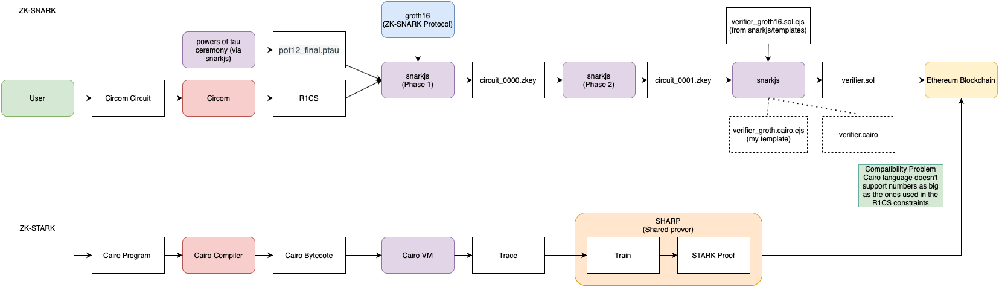

# Circom export to Cairo

Diagram of ZK-SNARK and ZK-STARK flux:



This Repository contains the following:

- verifier_groth16.cairo a work-in-progress template for cairo
- verifier_groth16.sol the original template used by snarkjs to generate a SolidityVerifier
- playground.cairo a cairo file used to test smaller functions inside the template
- Makefile used tu compile and run the playground.cairo through the commands "make compile" and "make run", and "make generate_verifier", used to create a verifier.cairo with our template (explained below)
- Dockerfile used to create a docker image with everything ready to compile and run cairo code, and generate a verifier through snarkjs
- example_001.zkey, a validation key generated though circom from a basic circuit

## Instructions to use the cairo template

First write and compile a circuit and compute the witness through circom, then generate a validation key through snarkjs (this process is properly explained at https://docs.circom.io/getting-started/installation/), this will yield a .zkey, which we can use to generate a solidity verifier through the command:

``` bash
snarkjs zkey export solidityverifier [name of your key].zkey [nme of the verifier produced]
```

What we can do with this is change the name of our cairo template to verifier_groth16.sol.ejs and use it ro replace the original file in snarkjs/templates, so that a "CairoVerifier" is produced instead of a Solidity one.

The Makefile has a shortcut "generate_verifier" that will copy our template into the templates folder and generate a verifier from the example zkey provided (example_001.zkey)

### How to test this process in a Docker container

* Create a docker container with the compiler and all the requirements:
``` bash
docker build -t circomtest .
```
* Log into the container created:
``` bash
docker run -it --rm circomtest bash
```
the prompt will be located at the `/home` directory. The file `verifier_groth16.cairo` is the template file that generates Cairo code. The provided commands are written in the `Makefile`.
* To run the generation of the verifier:
``` bash
make generate_verifier
```
it generates the file `verifier.cairo`.

If you want to test this process without docker, you should put the template file (`verifier_groth16.cairo`) in the same directory that npm puts the program files (`npm root -g` shows that directory).

## Main doubts/Problems with this solution

The numbers provided by the zkey are too big for the cairo program (Cairo language cant support such numbers, which leads to output being truncated, and incompatibility with math library functions). These numbers come from the R1CS, which defines a set of equations modulo p, where F_p is the field where the values of the arithmetic circuit reside. This makes me question wether the approach of making a cairo template is correct, as the original template is based off of the groth16 protocol, for ZK-SNARK proofs, while Cairo was designed to be used with the STARK protocol. This makes me question where does my "cairo verifier" fit into the diagram, and "who", would verify it.


